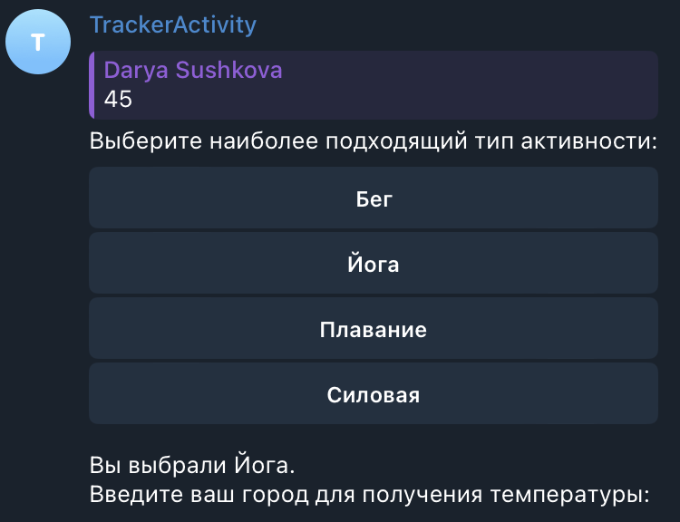

# ДЗ-2 продвинутый python ИИ24
Сушкова Дарья Сергеевна

### Структура проекта
1. Директория `\bot` содержит кодовую базу реализации бота и включает следующие `.py` файлы:
    - `config.py`: инициализация ключей и настройка логирования бота;
    - `handlers.py`: реализация роутера и обработчиков бота;
    - `states.py`: инициализация объектов FSM;
    - `utils.py`: вспомогательные функции взаимодействия с API, расчета норм и построения графиков;
    - `bot.py`: точка входа в приложение, запускающая бот с подключенным роутером.

2. Директория `\optionals` включает дополнительные файлы - скриншоты для демонстрации работы. 

### Уточнения ТЗ
1. В профиль пользователя добавлены следующие характеристики:
- пол человека,
- тип активности (доступные значения: бег, йога, плавание, силовая);

    Данные атрибуты дополнительно участвуют в расчете дневной нормы калорий по уравнению Харриса-Бенедикта, а тип тренировок также влияет на формулу расчета сожженных калорий.<br>

2. Команда `/log_food` сразу запрашивает все параметры (продукт + граммовка), без разбиения на несколько пользовательских вводов. Формат: `/log_food <product_name>, <product_weight>`. Пользователь может не указывать граммовку, тогда вес будет по умолчанию равен $100$ г.<br>

3. Расчет температуры происходит при каждой инициализации профиля, а также с наступлением нового дня (при вызове команды `/new_day`).<br>

4. Расчет нормы калорий происходит только при каждой инициализации профиля.<br>

5. Пользователь может менять данные профиля, повторно вызвав команду `/set_profile`.

6. В боте предусмотрено четыре типа активностей: бег, йога, плавание, силовая. Очевидно, что в реальной жизни таковых намного больше, в рамках задания было решено формализовать список.
    Каждому типу активности сопоставлено количество сжигаемых ккал/мин:
    ```python
    ACTIVITY_CALORIES = {
        "бег": 10,     
        "плавание": 8,  
        "силовая": 6,   
        "йога": 3   
    }
    ```

7. Если пользователь вводит некорректный город при заполнении профиля (некорректный - невозможно получить температуру через внешнее API), система устанавливает дефолтное значение как `Москва`.

### Дополнительные команды
1. `new_day` - команда предназначена для отсчета нового дня трекинга, то есть обнуляется количество потребленной воды и калорий, сожженных калорий. Команда также выводит результаты по воде и балансу калорий за предыдщий период трекинга.<br>
2. `profile_info` - команда просмотра информации из профиля пользователя, внесенной в предыдущий вызов команды `/set_profile`.

### Внешние API
1. Для получения текущей температуры для города используется сервис $\text{OpenWeatherMap API}$. Значение возвращается в градусах Цельсия, город можно передавать как на русском, так и на английском языках;
2. Для получения калорийности продуктов используется сервис $\text{Open Food Facts}$. Помимо наименования продукта возможно передавать его граммовку. Берется первый в выдаче продукт из списка, который заполняется прочими пользователями, поэтому значение калорийности иногда оказывается ошибочным / нулевым.

### Демонстрация работы
Запуск бота с помощью команды `/start`:<br>
<br>
Вывод помощи через вызов команды `/help`:<br>
<br>
При попытке вызвать команды логирования воды или калорий, проверки прогресса и прочие без заданного профиля, пользователь получит предупреждение:<br>
<br>
При вызове команды `/set_profile` пользователь должен последовательно ввести запрашиваемые данные. Бот проверяет введенные значения на валидность и в случае ошибки выводит вспомогательное сообщение, после которого ввод продолжается. Например, для веса введено отрицательное число:<br>
<br>
Помимо текстового ввода при заполнении профиля применяется клавиатура для типа активности:<br>
<br>
При вводе города бот проверяет его корректность - отдает ли сервис OpenWeatherMap API данные. Если указано невалидное название, бот предлагает использовать дефолтное значение ('Москва') с помощью отправки '+' либо повторно ввести корректное название. Следующим шагом требуется ввод дневной цели по потреблению калорий, однако пользователь также может запросить автоматический расчет по формуле, отправив '-':<br>
<br>
После заполнения бот выводит общую информацию, заполненную в текущий запуск команды:<br>
<br>
Пользователь может в любой момент времени просмотреть актуальную информацию из профиля, вызвав команду `/profile_info`:<br>
<br>
После заполнения профиля пользователь может приступать к трекингу активности. Например, логирование воды с указанием количества мл через команду `/log_water`:<br>
<br>
Команды логирования также проверяются на валидность переданных параметров. Например, при логировании тренировок `/log_workout` пользователь получает вспомогательные сообщения в случае ошибок:<br>
<br>
Как только пользователь введет валидное значение, бот сохранит в текущий прогресс рассчитанные данные:<br>
<br>
Логирование продукта через команду `/log_food` требует ввода наименования продукта, дополнительно пользователь может указать граммовку для более четкого расчета калорий:<br>
<br>
Чтобы посмотреть текущий результат по воде и калориям, пользователь должен вызвать программу `/check_progress`. Бот также предоставит графики потребления воды (круговая диаграмма) и статистику по калориям (столбчатая диаграмма):<br>
<br>
Для того, чтобы обнулить текущий прогресс и начать трекинг заново, пользователь должен вызвать команду `/new_day`. Бот также выведет результаты за предыдущий период трекинга:<br>


### Деплоймент
Для деплоймента я выбрала онлайн-сервер $\text{Railway}$, позволяющий разворачивать сервисы из GitHub-репозитория.<br>
Логи сброки контейнера:<br>
<br>
Логи деплоя сервиса:<br>
<br>